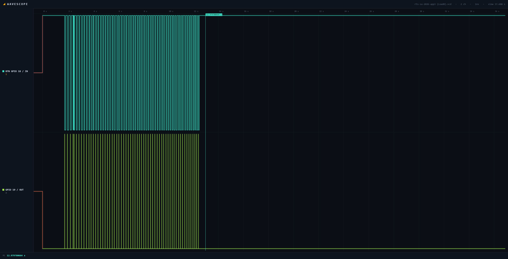
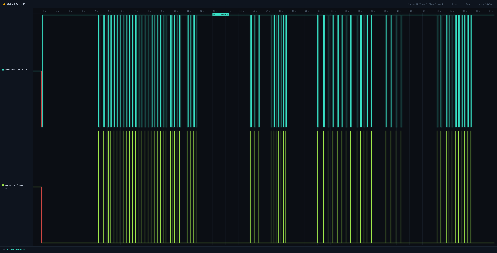

# ULMER-FINAL-RTS26Summer
# Real-Time Drop Tower Emergency-Stop Controller

An ESP32-S3 and FreeRTOS emergency-response system that compares
interrupt-to-task wake latency using a binary semaphore and a direct
task notification under idle, loaded, and fault-injection conditions.

## Project Links

- [Portfolio Website](https://peyton-u.github.io/ULMER-FINAL-RTS26Summer/)
- [Wokwi Simulation](https://wokwi.com/projects/467902690408566785)
- Demo Video: Add YouTube link here

## Project Overview

This project simulates an industrial emergency-stop controller for a
drop-tower attraction. Pressing the emergency-stop button on GPIO 18
generates an interrupt on the ESP32-S3.

The interrupt service routine records its entry time, pulses GPIO 19 for
logic-analyzer measurement, and wakes two FreeRTOS responder tasks:

1. A binary-semaphore responder
2. A direct-task-notification responder

The application measures the time between ISR entry and the beginning of
each responder task. Tests were performed with the background workload
disabled, enabled, and with an intentional ISR fault.

## Technologies Used

- ESP32-S3
- FreeRTOS
- Wokwi
- GPIO interrupts
- Binary semaphores
- Direct task notifications
- Priority-based scheduling
- WCET measurement
- Logic-analyzer timing
- Fault injection
- GitHub Pages

## System Architecture


The emergency-stop button triggers the GPIO interrupt service routine.
The ISR signals both responder tasks using two different FreeRTOS
communication methods.

Both responder tasks run on Core 1 at priority 12. When background load
is enabled, Task A has priority 15 and can delay the responders. Tasks B,
C, and D have lower priorities and cannot preempt a responder after it
begins running.

## Task Table

| Task | Trigger or Period | Priority | Core | Purpose |
|---|---|---:|---:|---|
| Task A | 10 ms | 15 | 1 | Highest-priority background workload |
| Semaphore responder | GPIO interrupt | 12 | 1 | Binary-semaphore response path |
| Notification responder | GPIO interrupt | 12 | 1 | Direct-notification response path |
| Task B | 20 ms | 10 | 1 | Periodic background workload |
| Task C | 50 ms | 5 | 1 | Periodic background workload |
| Task D | 100 ms | 2 | 1 | Lowest-priority background workload |

## Experimental Results

| Test Condition | Semaphore Maximum | Notification Maximum |
|---|---:|---:|
| Load 0: background tasks disabled | 3,178 µs | 30 µs |
| Load 1: background tasks enabled | 10,369 µs | 22,951 µs |
| Fault injection: ISR yield removed | 34,835 µs | 44,843 µs |

### Load 0



With background tasks disabled, the direct task notification recorded
the lowest maximum latency.

### Load 1



With Tasks A through D enabled, both response paths experienced greater
latency. Task A could delay the responders because its priority was
higher than priority 12.

## Fault Injection

The induced failure removed:

```c
portYIELD_FROM_ISR(higher_woken);
